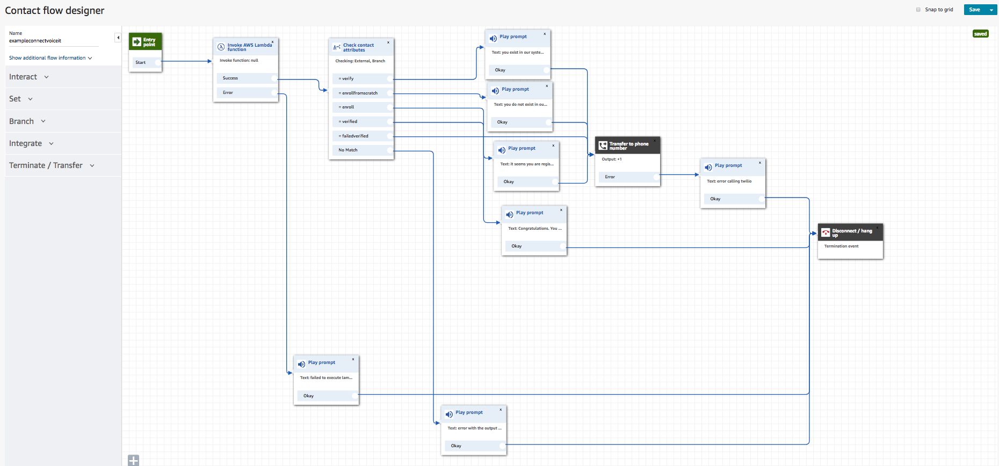

# Amazon Connect & VoiceIt 2.0 Voice Integration Demo
### Andrew Lee
---

We created this repository for our clients who want to integrate our services with Amazon Connect's Call Center functionality.

Both programs are intended to run on AWS Lambda as part of a serverless architecture. They are in a sense, intended to run together, and utilize AWS DynamoDB to "glue" together their logic as well as ensure a secure way to signal a successful authentication from Twilio's server back to Amazon Connect.

The directory structure is as follows:

| *Path* | *Language* | *Description* |
| -- | -- | -- |
| [/connect-twilio-initial](./connect-twilio-initial) | Go | Server which encompasses the initial server side logic when the user calls Amazon Connect |
| [/twilioserver](./twilioserver) | NodeJS | Server that handles call recording using using Twilio's API |

If you need help setting up your workflow, see [exampleconnectvoiceit](./exampleconnectvoiceit) for inspiration.


---

## Deploying Example

### Prerequisites
1. Amazon Connect Call Instance with a free phone number
2. AWS DynamoDB table (we named ours `ConnectTwilio` which will be referenced throughout code) with the primary key `phoneNumber` of type String
3. Twilio account with a free phone number
4. Clone this repository somewhere on your local work environment
5. Locally installed [Go](https://golang.org/doc/install) and `$GOPATH` environment variable set up
6. Locally installed [node/npm](https://nodejs.org/en/download/)

### Deploying the Amazon Connect Initial Server

> In Amazon Connect Call Center Console...
1. Create a new contact flow, and use `Import flow` option to upload [our Contact Flow file](./exampleconnectvoiceit)

> In AWS Lambda web UI...

2. Create a new Lambda Function with the `Go 1.x` runtime (Either create a new role, or use an existing role with Full Access to DynamoDB).
3. Add an API Gateway trigger (Create a new API with Security=Open [other options can be left to default values])

> In `aws cli`...

4. Add permission to allow your Lambda Function to be accessed from Amazon Connect

```shell
aws lambda add-permission --function-name function:[your_lambda_function_name] --statement-id 1 --principal connect.amazona
ws.com --action lambda:InvokeFunction --source-account [source_account_number_of_lambda_function] --source-arn [arn:of_amazon_connect_instance]
```

> In your local machine...

5. Install VoiceIt Go wrapper, AWS-Lambda library, and AWS-SDK

```shell
go get -u github.com/voiceittech/VoiceIt2-Go
go get -u github.com/aws/aws-lambda-go/...
go get -u github.com/aws/aws-sdk-go/...
```

6. `cd` into the `connect-twilio-initial` directory in this repository, build the executable for Lambda, and package it into a ZIP file

```shell
cd [root_of_cloned_repository/connect-twilio-initial]
GOOS=linux go build -o main
zip deployment.zip main
```

> Back in AWS Lambda web view for the function you created...

7. Upload the `deployment.zip` file you just created under the "Function Code" section, and change the `Handler` attribute from 'hello' to 'main'
8. Add the environment variables `VIAPIKEY` and `VIAPITOKEN` (which you can view at [https://voiceit.io/settings](https://voiceit.io/settings) under API 2.0 Credentials)
9. Save
10. Take note of the Lambda ARN at the top of the page, which will look like `arn:aws:lambda:[location]:00000000000:function:[functionname]` which we will plug into the Contact Flow

> Back in Amazon Connect Call Center Console Contact Flow view...

11. Change the `Function ARN` parameter in the "Invoke AWS Lambda function" designer element to match the above arn for the Lambda function you created
12. Change the `Phone number` parameter in the "Transfer to phone number" designer element to match the Twilio phone number you created
13. Save & Publish
14. Go to Phone Numbers, and select the Contact Flow you just created for the `Contact flow/IVR` parameter
15. Save

**Congratulations, you now have the initial logic portion of the Amazon Connect Call center up and running! Now it's time to set up the Twilio server which handles the actual enrollment/verification to VoiceIt.**

### Deploying the VoiceIt (Twilio) Server

> In your local machine...

5. Install VoiceIt Go wrapper, AWS-Lambda library, and AWS-SDK
